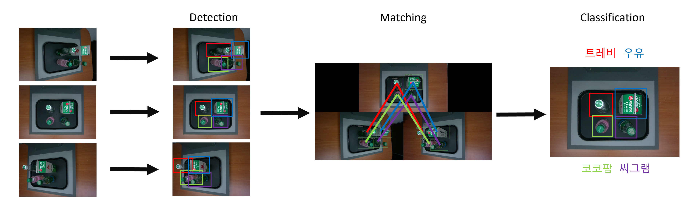

- Left / Top / Right view에서 촬영하는 3대의 카메라에서 인공지능 모델을 통해 상품을 탐지하고​
- 상품의 가격 합을 계산하여 소비자에게 안내하는 무인계산대 시스템​
- 물품 추가 시 적은 개수의 데이터로 추가학습을 통해 모델 업데이트 가능

- Project Detail
    - 출연: 기산전자
    - 기간: 2022.12.01 ~ 2023.12.31 (1년)
    - 사업비: 100,000,000 원